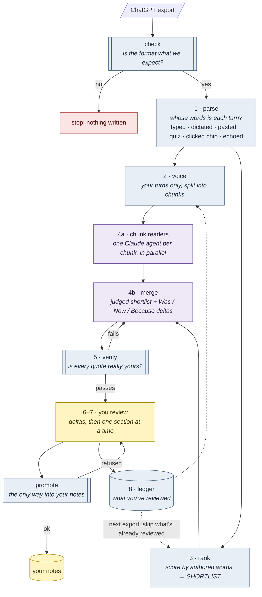

# said-it-first

Turn years of ChatGPT conversations into a record of how your thinking
changed, without putting the model's words in your mouth.

If you think out loud in ChatGPT, your chat history is your real journal, but
it is buried under homework, code, pasted articles, and the assistant's half of
every thread. This pipeline digs out what's yours, ranks it by *did this change
what I think*, has Claude read the candidates, **verifies every quote against
the source**, and walks you through approving notes one section at a time.

Built on my own ChatGPT archive first. See [METHOD.md](METHOD.md) for what
broke and why each piece exists. The reference run, in aggregate (no
conversation content is in this repo):

| | |
|---|---|
| Export | 4,164 conversations over nearly four years; 1,628 with 50+ words from me |
| Words in my turns | 701,883, of which 234,739 (33%) were pasted, quiz answers or clicked suggestions, and 4,283 were echoes of the assistant |
| Corpus the models read | ~6.5M tokens with the assistant's turns, ~1M without |
| Review | 126 conversations read and decided on over about two weeks |
| Result | idea notes went from 73 to 120; ~330 quotes verified verbatim |
| Re-audit | the stricter `verify` found 2 quotes in finished notes that ChatGPT had written first |



Blue steps are scripts, purple steps are Claude agents, yellow steps are
you. Scripts sort and check, Claude reads, and you decide. Nothing reaches
your notes without passing `verify` and your approval.

## What makes it different

- **Authorship-aware.** Every user turn is classified: written by you,
  dictated by you, pasted, a quiz answer, or a clicked suggestion. On the
  reference archive, 33% of "user" words weren't the user's.
- **Voice memos weighted up, not down.** Long pasted turns are either
  someone else's article or your own dictated thinking. It decides by voice,
  not length.
- **Deltas, not snapshots.** Notes record *Was / Now / Because*, so you can see
  what you thought in 2023, what you think now, and what changed it.
- **Gated.** `synth promote` is the only way into your notes, and it refuses
  any note whose quotes fail verification.
- **Verified.** `synth verify` catches paraphrase in quotation marks, lines
  the assistant coined that you echoed back (even with your words in front),
  and quotes lifted from pastes or clicked suggestions. The model's own
  reports never flagged these.
- **Built to be run again.** A ledger remembers what you reviewed, so your
  next export only surfaces what's new (or what you continued since).
- **Any archive size.** The corpus is split into chunks that parallel reading
  agents take one at a time, so it works with ordinary context windows.
- **Local, stdlib-only Python.** No dependencies. The scripts never touch the
  network.

## Quickstart

Requires Python 3.11+ and [Claude Code](https://claude.com/claude-code) for
the reading stages.

```bash
git clone <this repo> && cd said-it-first
python3 -m unittest discover tests          # tests on a synthetic export
python3 -m synth run examples/sample-export # try the scripts on fake data
```

To see what a complete run produces, from reading notes to promoted notes,
look at [examples/dry-run/](examples/dry-run/): the whole skill run on the
sample export for a fictional owner.

Then with your own export (ChatGPT: Settings -> Data controls -> Export data):

```bash
cp said-it-first.example.toml said-it-first.toml
cp templates/profile.example.md profile.md    # or let the skill interview you
claude
> /archive-synthesis ~/Downloads/<your-export>.zip
```

The skill runs the scripts, checks the counts, dispatches the reading agents,
runs verification, and stops for your approval at every step that writes to
your notes.

## Stages

| # | Stage | Who | Output |
|---|---|---|---|
| 1 | `synth parse` | script | format check, then one markdown file per conversation + `index.json` |
| 2 | `synth voice` | script | your turns only, by year (the corpus models read) |
| 3 | `synth rank` | script | `SHORTLIST.md`, triage by authored words, voice, depth |
| 4a | chunk reading | `chunk-reader` agents, in parallel | reading notes per chunk |
| 4b | merge | `shortlist-reviewer`, `delta-reconstructor` agents | judged shortlist, staged deltas |
| 5 | `synth verify` | script | every quote checked against source |
| 6 | delta review | **you**, then `synth promote` | approved deltas become notes |
| 7 | section loop | `section-extractor` agent + **you**, then `synth promote` | extraction sheet -> approved notes |
| 8 | `synth ledger sync` | script | reviewed conversations skipped next export |

Utilities: `synth check <export>` (validate the export format without
writing anything; `parse` runs it first), `synth stats` (calibrate authorship
on your archive),
`synth ledger show`, `synth paths`.

## Configure

Everything personal lives in `said-it-first.toml` (gitignored): your topics,
dated position changes, platform markers, weights. See
[said-it-first.example.toml](said-it-first.example.toml). `profile.md` tells
the agents who you are now, so they can tell an old position from a current
one.

Point `paths.notes` at your Obsidian vault (or any folder). Links default to
`[[wikilinks]]`; set `link_style = "markdown"` otherwise.

## Privacy

Your archive is about as personal as data gets.

- The scripts are local. `workspace/`, your config, and your profile are
  gitignored.
- **Stages 4 and 7 send conversation text to the model** through Claude Code.
  Decide what you're comfortable with before running them; the profile has an
  out-of-scope section for topics that should never be extracted.
- Never commit your workspace. `git status` before every push.

## Layout

```
synth/                  the pipeline (parse, voice, rank, verify, promote, ledger, stats)
.claude/skills/         archive-synthesis: the orchestrator
.claude/agents/         chunk-reader, shortlist-reviewer, delta-reconstructor, section-extractor
.github/workflows/      tests on Python 3.11-3.13
templates/              note format, extraction sheet, profile
examples/sample-export/ synthetic export (tests/make_fixture.py builds it)
examples/dry-run/       a full run of the skill on it, every stage's output + FINDINGS.md
tests/                  one test per failure mode in METHOD.md
```

## License

MIT
